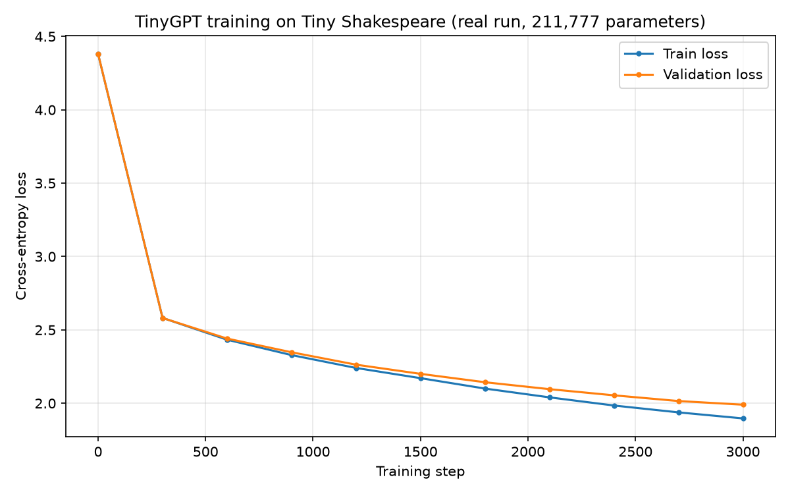

# Transformer From Scratch

> Status: 🚧 In progress — Tier 0 foundations project.

## Hook
A GPT-style language model built from first principles — no pre-built transformer library —
to understand exactly what's happening inside attention, and to have a working, trained
model to show for it.

## Problem
Most people who "use" LLMs have never implemented the mechanism that makes them work.
This project implements a small transformer (tokenization → embeddings → positional
encoding → multi-head self-attention → feed-forward → training loop) from scratch in
PyTorch, then trains it on a small text corpus to generate text in that style.

## Architecture

In plain terms: text goes in as tokens, gets turned into numbers (embeddings), then for
each word the model asks "which earlier words matter most for predicting what comes
next?" (that question-asking step is called **attention**), blends the important ones
together, processes the result a bit more, and outputs a prediction for the next word.


- **Query / Key / Value** are three different "views" of the same input: Query = "what am
  I looking for", Key = "what do I contain", Value = "what info do I pass along if picked".
- **Attention Scores** = comparing every Query against every Key to get a relevance score
  per word-pair.
- **Weighted Sum** = blending the Values together, weighted by those relevance scores —
  this is the actual "attending" step.

(Diagram is animated in the source SVG — open `docs/architecture-attention-flow.svg`
directly, or view it on GitHub, to see the data flow in motion.)

**📚 Want the concepts explained one at a time, in plain language, with their own
diagrams?** See [`concepts/`](concepts/README.md).

## Metrics
Real completed training run — 211,777 parameters, trained 3000 steps (45.5s) on a Mac's
Apple Silicon GPU (MPS):



| | Train loss | Val loss |
|---|---|---|
| Step 0 (untrained) | 4.38 | 4.38 |
| Step 3000 | 1.90 | 1.99 |

The untrained loss (4.38) closely matches the theoretical random-guess baseline of
`ln(65) ≈ 4.17` for this 65-character vocabulary — confirming the model starts out
knowing nothing, exactly as it should. Full numbers: [`training_history.json`](training_history.json).

Sample generation after training (300 characters, prompt: `"To "`):
```
To me haly uby chaved efter, Esolces,
Is if the and anvers.ut I
ewave you him you
 a mup bot bear ardange. Gos he ras in, souspaunt;
Benide that be arences onier oublys.

BESS:
That what will I mink,
To Ay to the best you, would exenon!
```

## Tradeoffs
- **Small model, briefly trained**: 212K parameters and 3000 steps is tiny compared to
  real LLMs (billions of parameters, millions of steps) — the output is recognizably
  Shakespeare-*shaped* (dialogue formatting, character names) but not coherent prose.
  That's the honest, expected result at this scale, not a shortcoming to hide.
- **Character-level tokenization**: simpler to implement and understand than subword
  (BPE) tokenization, but means the model has to learn spelling from scratch alongside
  grammar and structure, which is harder than it needs to be for a production system.
- **CPU/MPS-only**: trained locally on a Mac, no multi-GPU/distributed training here —
  that's covered by a separate Tier 2 project in the roadmap.

## Link
[Concepts walkthrough](concepts/README.md) — the full pipeline explained one concept at
a time. Live inference demo not yet built (would need a hosting step beyond this repo's
scope for now).
