# Transformer From Scratch

> Status: 🚧 In progress — Tier 0 foundations project.

## Hook
A GPT-style language model built from first principles — no pre-built transformer library —
to understand exactly what's happening inside attention, and to have a working, trained
model to show for it.

## Problem
Most people who "use" LLMs have never implemented the mechanism that makes them work.
This project implements a small transformer (tokenization → embeddings → positional
encoding → multi-head self-attention → feed-forward → training loop) from scratch in
PyTorch, then trains it on a small text corpus to generate text in that style.

## Architecture

In plain terms: text goes in as tokens, gets turned into numbers (embeddings), then for
each word the model asks "which earlier words matter most for predicting what comes
next?" (that question-asking step is called **attention**), blends the important ones
together, processes the result a bit more, and outputs a prediction for the next word.

- **Query / Key / Value** are three different "views" of the same input: Query = "what am
  I looking for", Key = "what do I contain", Value = "what info do I pass along if picked".
- **Attention Scores** = comparing every Query against every Key to get a relevance score
  per word-pair.
- **Weighted Sum** = blending the Values together, weighted by those relevance scores —
  this is the actual "attending" step.

(Diagram is animated in the source SVG — open `docs/architecture-attention-flow.svg`
directly, or view it on GitHub, to see the data flow in motion.)

## Metrics
_TBD once training runs — will report loss curves and sample generations, not just claims._

## Tradeoffs
_TBD — will document scale limits (small model, small dataset, CPU/MPS-only) honestly._

## Link
_Demo/notebook link coming once built._
