# Concepts — Overview

> The ideas behind this project, explained simply. Each links to the exact code that
> implements it.

## The big picture, in one plain sentence
A transformer turns text into numbers, figures out which earlier words matter most for
predicting the next one, and repeats that reasoning a few times before making its guess.

## The pipeline, step by step
1. **[Tokenization](tokenization.md)** — turn text into numbers (one number per character).
2. **[Embeddings](embeddings.md)** — turn those numbers into learned vectors that carry
   both *meaning* (what the character is) and *order* (where it sits in the sequence).
3. **Attention** _(coming next)_ — for each word, decide which earlier words are most
   relevant to predicting what comes next.
4. **Feed-Forward layer** _(coming)_ — process each word's result a bit further on its own.
5. **Stack blocks** _(coming)_ — repeat attention + feed-forward several times, each
   pass refining the model's understanding.
6. **Next-token prediction** _(coming)_ — turn the final vector back into a probability
   over every possible next character, and pick (or sample) one.
