# Attention (Self-Attention, Causal/Masked)

## Plain-language explanation
For every token, attention asks: "which earlier tokens should I pay attention to, and
how much?" It does this using three learned projections of the same input vector:

- **Query (Q)** — "what am I looking for?"
- **Key (K)** — "what do I contain, that others might look for?"
- **Value (V)** — "what information do I actually hand over, if picked?"

The steps: compare every Query to every Key (a dot product) to get a relevance score
per pair → scale the scores down (divide by √head_size, so they don't get huge and
destabilize training) → run through **softmax** (turns raw scores into percentages
that sum to 100% — "how much attention goes to each earlier token") → use those
percentages to blend the Value vectors together. That blend is the attention output.

**Causal masking**: a GPT-style model predicting the next word must never see FUTURE
tokens (that's like reading the answer before the question). We enforce this by setting
any score pointing to a future position to `-infinity` BEFORE softmax, so after softmax
it becomes exactly 0% attention. This is why it's called "masked" self-attention.

## Why it matters
This is THE mechanism that makes transformers work — everything else (embeddings,
feed-forward layers) exists to feed into or process the output of attention.

**Multi-head attention** (the actual thing used in real models) just runs several of
these attention computations in parallel on smaller slices of the vector, then
concatenates the results — each head can specialize in a different kind of relevance
(e.g. one head might track subject/verb agreement, another might track punctuation).

## Where it's implemented
- [`src/attention.py`](../src/attention.py) — single-head, hand-rolled Q/K/V math + causal mask.
- [`src/multi_head_attention.py`](../src/multi_head_attention.py) — runs multiple heads
  in parallel, concatenates.
- Verified two ways: (1) attention weights for any token sum to exactly 1.0 (softmax is
  correct), (2) the FIRST token's weights are exactly `[1, 0, 0, ...]` since it can only
  attend to itself — direct proof the causal mask works, not just code that compiles.
