# Embeddings (Token + Positional)

## Plain-language explanation
A tokenizer gives you an ID number (e.g. "h" -> 7), but 7 by itself carries no meaning —
it's just an arbitrary label. An **embedding** replaces that ID with a small list of
numbers (a vector, e.g. 32 numbers) that the model *learns* during training. Over time,
characters/words that behave similarly in text end up with similar vectors — this is how
a model captures "meaning" numerically.

Attention (the next concept) compares every token to every other token, but has no
built-in sense of *order* — it would treat "ab" and "ba" identically. A **positional
embedding** fixes this: a second learned vector, one per position in the sequence
(position 0, 1, 2, ...), added on top of the token's own vector, so the model can tell
"this is the 1st character" from "this is the 5th character".

Final input to the rest of the model = token vector (what) + position vector (where).

## Why it matters
Without embeddings, the model would be working with meaningless arbitrary integers.
Without positional information specifically, a transformer's attention mechanism is
**permutation-invariant** — order wouldn't matter to it at all, which is obviously wrong
for language. This is why transformers need positional encoding but RNNs don't as
strictly: RNNs process tokens one at a time in order, so order is implicit in how they
work; transformers process all tokens at once via attention, so order must be explicitly
injected.

## Where it's implemented
[`src/embeddings.py`](../src/embeddings.py) — verified: input shape `(batch=1, seq_len=13)`
of IDs → output shape `(1, 13, embed_dim=32)` of vectors, confirmed trainable (`grad_fn`
present on output).
