# Tokenization

## Plain-language explanation
A computer only understands numbers, not letters. Tokenization is the step that turns
text into numbers (so a model can read it) and turns numbers back into text (so we can
read the model's output).

The simplest version — **character-level** tokenization — just gives every unique
character its own ID number. If "h" is the 8th unique character found in the training
text, every "h" becomes the number 7 (IDs usually start at 0). "hello" might become
`[7, 4, 11, 11, 14]`. Decoding just reverses the lookup: numbers back to characters.

## Why it matters
Every model needs *some* tokenizer. Character-level is the simplest possible choice and
good for learning, but real LLMs (GPT, Claude, etc.) use **subword** tokenizers (like
BPE — Byte Pair Encoding) that group common character sequences into single tokens
(e.g. "ing" might be one token, not four). Subword tokenizers give a smaller vocabulary
for the same text and let the model handle words it's never seen before by breaking them
into familiar pieces. Character-level is a reasonable stepping stone before learning BPE.

## Where it's implemented
[`src/tokenizer.py`](../src/tokenizer.py) — verified: 65-character vocabulary on Tiny
Shakespeare (matches the known nanoGPT baseline for this exact dataset), encode/decode
round-trip passes.
