# Transformer Block (Feed-Forward, Residual Connections, Layer Norm)

## Plain-language explanation
One "block" is the repeating unit that gets stacked N times to build the full model.
Each block has two stages, and both stages follow the same wrapping pattern:

1. **Attention stage**: normalize the input → run multi-head attention → add the
   ORIGINAL (pre-normalized) input back on top of the result.
2. **Feed-forward stage**: normalize → run the feed-forward layer → add the input from
   before this stage back on top of the result.

**Feed-forward layer**: attention mixes information ACROSS tokens (each token looks at
others). Feed-forward processes each token entirely on its OWN — a small 2-layer neural
net that expands the vector (e.g. 4x bigger), applies a non-linearity (GELU), then
shrinks it back down. Think of attention as "gathering info from your neighbors" and
feed-forward as "privately thinking over what you just gathered."

**Residual connection** (the "Add" step): instead of just `output = layer(input)`, we do
`output = input + layer(input)`. This gives training a direct shortcut path for
gradients to flow through, so stacking many blocks doesn't cause information/gradients
to vanish as they pass through layer after layer.

**Layer normalization**: rescales each token's vector to a consistent, well-behaved
range (mean 0, variance 1) before it enters a sub-layer. We use "pre-norm" (normalize
BEFORE the sub-layer) — the modern standard since GPT-2, more stable to train than the
original 2017 "Attention Is All You Need" paper's post-norm design.

## Why it matters
This block is THE unit that gets copied N times (GPT-2 small = 12 blocks, GPT-3 = 96) to
build the full model depth. Understanding one block completely means you understand the
entire architecture — stacking is just "repeat this same shape."

## Where it's implemented
- [`src/feed_forward.py`](../src/feed_forward.py)
- [`src/transformer_block.py`](../src/transformer_block.py) — combines attention +
  feed-forward + residuals + pre-norm.
- Verified: output shape matches input shape after ONE block, and still matches after
  chaining a SECOND, independently-created block — direct proof blocks can be stacked,
  not just a theoretical claim.
